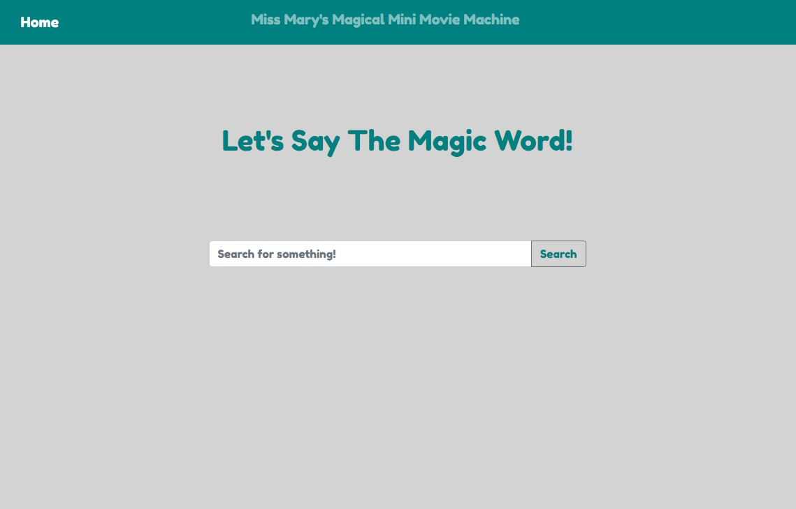
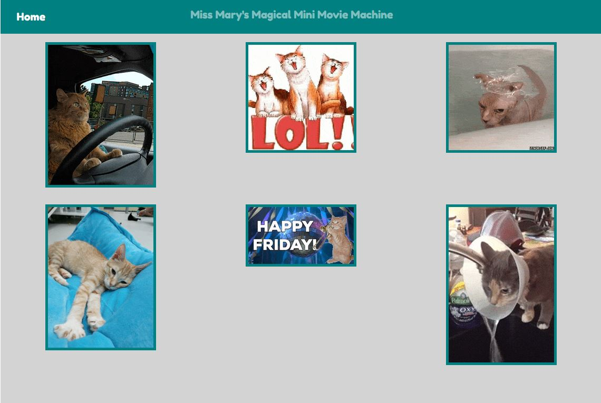
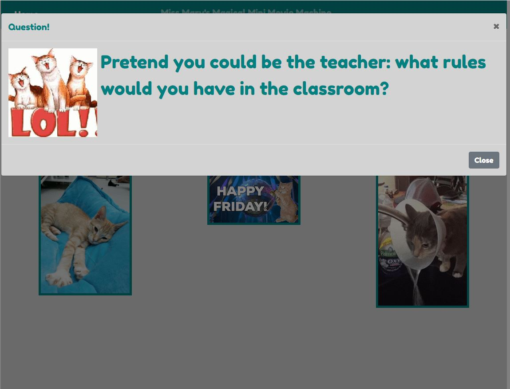

# PROJECT TITLE
- Miss Mary's Magical Mini Movie Machine

# CONCEPT 
- Description 
    - Miss Mary's MMMM pulls a selection of images based on a search term and starting at a randomized position which are then displayed in a still state. When clicked, the animated image is shown in a pop-up with a randomly determined conversation starter prompt.

- Motivation for development
    - In response to the social distancing efforts put in place but COVID-19, teachers are seeking new and fun ways to interact with their students remotely. This can be especially hard for children with significant learning challenges who may not have the inclination or ability to participate in broader classwork. This application is designed to be a fun way to engage children in a distance learning activity.

- User story
    - As a site visitor, I want to be able to connect with my students remotely and hold their interest while completing their work.

# TECHNOLOGIES USED
- HTML, CSS, Jquery, and Javascript

- Bootstrap Framework

- Giphy API – Provides both animated and still frame gifs standardized by width.
    - https://developers.giphy.com/

# FUTURE DEVELOPMENT
- Integrate Google Sheets API to allow easy modification of coversation prompts
- Modify search parameters to not only return G rated content but specifically tailored towards children.

# LINKS
- https://ravalash.github.io/MarysMovieMachine/
- https://github.com/ravalash/MarysMovieMachine

# SCREENSHOTS

Home Page

Search Results

Animated View

